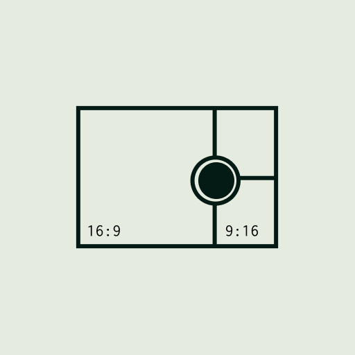

<div align="center">



# LiveGrid

**Transforme seu celular em uma estação de captura para OBS — horizontal 16:9 ao vivo, com gravação simultânea 16:9 + 9:16.**

[](https://flutter.dev) [](https://dart.dev) [](https://developer.apple.com/ios/) [](https://developer.android.com/) [](#licença)

</div>

---

## Por que existe

Plug seu iPhone ou Android numa rede Wi-Fi 5 GHz e ele vira **uma fonte de vídeo de baixa latência para o OBS Studio**, no estilo do DroidCam — porém com duas diferenças importantes:

1. **Sem driver no PC.** Conecta como Media Source nativa do OBS via TCP + MPEG-TS. Para virar webcam em Zoom/Teams/Meet basta usar a Câmera Virtual do próprio OBS.
2. **Modo gravação dual.** A mesma captura do celular gera, em paralelo, dois MP4: um 16:9 (YouTube/horizontal) e um 9:16 com crop ajustável (TikTok/Reels/Shorts). Ambos vão direto pra galeria do dispositivo.

Pensado para criadores que filmam horizontal e precisam do corte vertical sem retomar gravação, e para quem quer transformar o celular em câmera ao vivo de baixa latência sem sobrescrever um driver no Windows.

## Funcionalidades

| | |
|---|---|
| **Live para OBS** | Listener TCP + MPEG-TS H.264 na porta 9000. OBS conecta como Media Source. Latência alvo &lt; 400 ms no LAN. |
| **Multi-cliente broadcast** | Várias Media Sources do OBS podem ler o mesmo stream simultaneamente sem derrubar conexão. |
| **Gravação dual** | MP4 horizontal (1080p) + MP4 vertical (crop 9:16) gravados em paralelo, salvos na galeria. |
| **Crop vertical com centro ajustável** | Reposiciona o corte 9:16 dentro do frame 16:9 sem mover a câmera. |
| **3 perfis de captura** | Econômico (720p), Equilibrado (1080p), Qualidade (4K → 1080p). |
| **Política térmica** | Reduz bitrate, FPS ou desliga vertical conforme o aparelho aquece. |
| **Encoder por hardware** | VideoToolbox no iOS, MediaCodec no Android. CBR, B-frames=0, GOP=1s. |
| **Foreground service Android** | Mantém a captura viva com tela apagada. |
| **iOS + Android paridade** | Mesma feature set nas duas plataformas. |

## Como funciona

```
┌──────────────── Native (Swift / Kotlin) ────────────────┐
│  Câmera (AVCaptureSession / Camera2)                     │
│       │                                                  │
│       ├─► Preview Texture (Flutter)                      │
│       ├─► Encoder horizontal (HW H.264) ─► MPEG-TS mux ─►│
│       │                                     TCP listener │
│       │                                     :9000        │
│       └─► (recording) crop 9:16 ─► encoder ─► .mp4       │
└──────────────────────────────────────────────────────────┘
                       │ MethodChannel + EventChannel
                       ▼
┌──────────────────── Flutter (UI) ───────────────────────┐
│  LivePage  ·  SettingsPage  ·  SessionController        │
└──────────────────────────────────────────────────────────┘
```

**Sem FFmpeg, sem libsrt.** O multiplex MPEG-TS é implementação própria (PAT/PMT/PES/CRC32, pacotes 188 bytes) e o transporte é TCP cru — celular é listener, OBS é cliente.

## Setup

Requisitos: [Flutter](https://flutter.dev) 3.41.8 (gerenciado por [FVM](https://fvm.app)) e Dart `^3.11.5`. Xcode 15+ para iOS, Android Studio + SDK API 29+ para Android.

```bash
git clone <este-repo>
cd livegrid_app
fvm install
fvm flutter pub get

# rodar
fvm flutter devices
fvm flutter run -d <device-id>

# build de produção
fvm flutter build ipa
fvm flutter build apk --release
```

Comandos do dia-a-dia:

```bash
fvm flutter analyze       # lint
dart format .             # formatação
fvm flutter test          # testes
```

## Configurando o OBS

No celular, abra o app, vá em **Configurações → Rede** e copie o IP exibido. No OBS:

1. **Add Source → Media Source** (não "Browser", não "Stream").
2. Desmarque "Local File".
3. Preencha:
   - **Input**: `tcp://IP_DO_CELULAR:9000`
   - **Input Format**: `mpegts`
   - **Reconnect Delay**: `1`
   - Marque "Reiniciar reprodução quando ativa" e "Usar decodificação por hardware".
4. Clique **Argumentos avançados de entrada** e cole:

   ```
   fflags=nobuffer+discardcorrupt
   flags=low_delay
   probesize=32
   analyzeduration=0
   ```

5. Clique OK. Inicie a captura no app e a imagem aparecerá no OBS.

> **Sem essas flags**, o OBS buferiza ~1 s de MPEG-TS antes de exibir e parece "cortar". TCP cru não tem ARQ, então **Wi-Fi 5 GHz no mesmo AP** é obrigatório.

### Cena vertical 9:16 (crop dentro do OBS)

Não crie uma segunda Media Source nem instale plugin — use **Source Mirror**:

1. Crie uma cena nova com canvas `1080×1920`.
2. **Add Source → Source Mirror** e selecione a Media Source que você já criou.
3. Botão direito no Source Mirror → **Filters → +Crop/Pad**:
   - **Left**: `656`, **Right**: `656` (corta `(1920 − 1080·9/16) / 2` de cada lado).
4. Posicione/escale para preencher o canvas.

Para ajustar o "centro" do crop sem mover a câmera, use `Left ≠ Right` ou troque pela função **Crop vertical** dentro do app (passa pra gravação também).

### Câmera virtual em Zoom/Teams/Meet

OBS já tem **Câmera Virtual** embutida. No menu do OBS → **Iniciar Câmera Virtual**, e selecione "OBS Virtual Camera" como webcam no aplicativo de chamada. Não há driver de câmera para instalar no Windows ou no macOS além do que o próprio OBS provisiona.

## Perfis de captura

| Perfil | Captura | Encoder horizontal | Bitrate | Crop vertical (recording) |
|---|---|---|---|---|
| Econômico | 1280×720 (4:3) | 1280×720 @ 30fps | 3 Mbps CBR | 405×720 |
| Equilibrado | 1920×1080 (4:3) | 1920×1080 @ 30fps | 5 Mbps CBR | 607×1080 |
| Qualidade | 3840×2160 (4:3) | 1920×1080 @ 30fps | 6 Mbps CBR | 1215×2160 (FHD+) |

A política térmica reduz bitrate e FPS automaticamente conforme o aparelho aquece, e desliga o feed vertical em modo crítico.

## Decisões técnicas

| Tema | Escolha | Por quê |
|---|---|---|
| Transporte | TCP cru + MPEG-TS próprio | Sem dependências nativas. OBS conecta direto. |
| Encoder | Hardware (VideoToolbox / MediaCodec) | Encoder em SW derrete o aparelho com 4K dual. |
| FFmpeg / libsrt | Não usar | Mux próprio é suficiente. |
| Plugin `camera` Flutter | Não usar | Não expõe os controles necessários. |
| Crop 9:16 Android | Shader OpenGL | Zero cópia. |
| Estabilização (EIS/OIS) | Desligada | EIS faz crop do sensor e anula o full sensor. |
| B-frames | 0 | Latência + compatibilidade OBS. |
| GOP | 1 segundo (= FPS) | Recuperação rápida pós-perda. |
| Bitrate mode | CBR | Previsibilidade no LAN. |

## Estrutura do projeto

```
lib/                          Flutter (UI + controle)
  app/
    controllers/              SessionController + thermal policy
    models/                   resolution_profile, network_profile, ...
    pages/                    live_page, settings_page
    services/native_bridge    MethodChannel/EventChannel typed
    widgets/                  átomos, live, settings

ios/Runner/                   iOS nativo
  CameraPreview.swift         AVCaptureSession + FlutterTexture
  VideoEncoder.swift          VTCompressionSession (H.264 AnnexB)
  MpegTsMuxer.swift           Mux MPEG-TS próprio
  UdpPublisher.swift          TcpPublisher broadcast multi-cliente
  FileRecorder.swift          AVAssetWriter (MP4)

android/app/src/main/kotlin/br/com/wanmind/livegrid/   Android nativo
  camera/                     Camera2 + GL renderer + crop shader
  encoder/                    MediaCodec + EncoderPool + MpegTsMuxer
  stream/TcpPublisher         broadcast multi-cliente
  service/                    ForegroundService
```

A documentação interna detalhada (decisões, dívidas técnicas, contrato de platform channel) está em [`CLAUDE.md`](CLAUDE.md).

## Limitações conhecidas

- **iOS sem background real**: a sessão exige tela ligada. Documentar para o operador.
- **Crop vertical no iOS é CPU memcpy**: aquece em modo Qualidade (4K). Migrar para Metal está na lista.
- **TCP cru sem ARQ**: Wi-Fi 5 GHz no mesmo AP é obrigatório para evitar stalls.

## Roadmap

- [ ] Crop vertical iOS via Metal (zero-copy GPU).
- [ ] Câmera virtual nativa Windows (driver opcional, alternativa ao OBS Virtual Camera).
- [ ] Suporte a múltiplas câmeras simultâneas (frente + trás) em dispositivos compatíveis.
- [ ] Áudio (mic) opcional no stream.

## Licença

Proprietário © Memoot · Willian de Mattos. Todos os direitos reservados.
